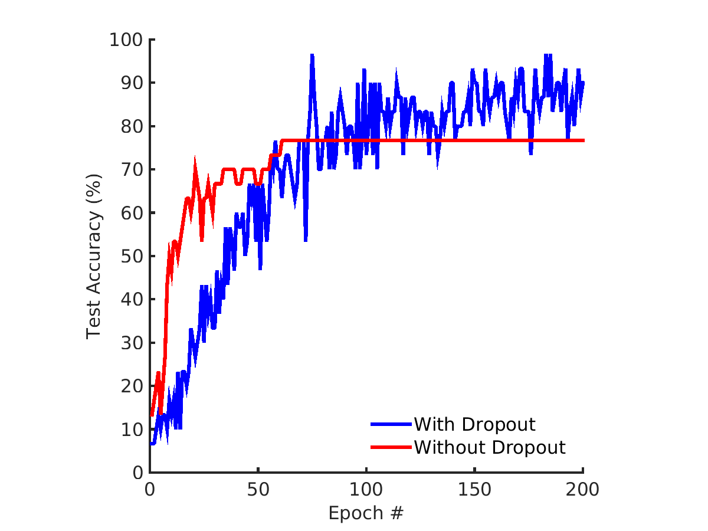
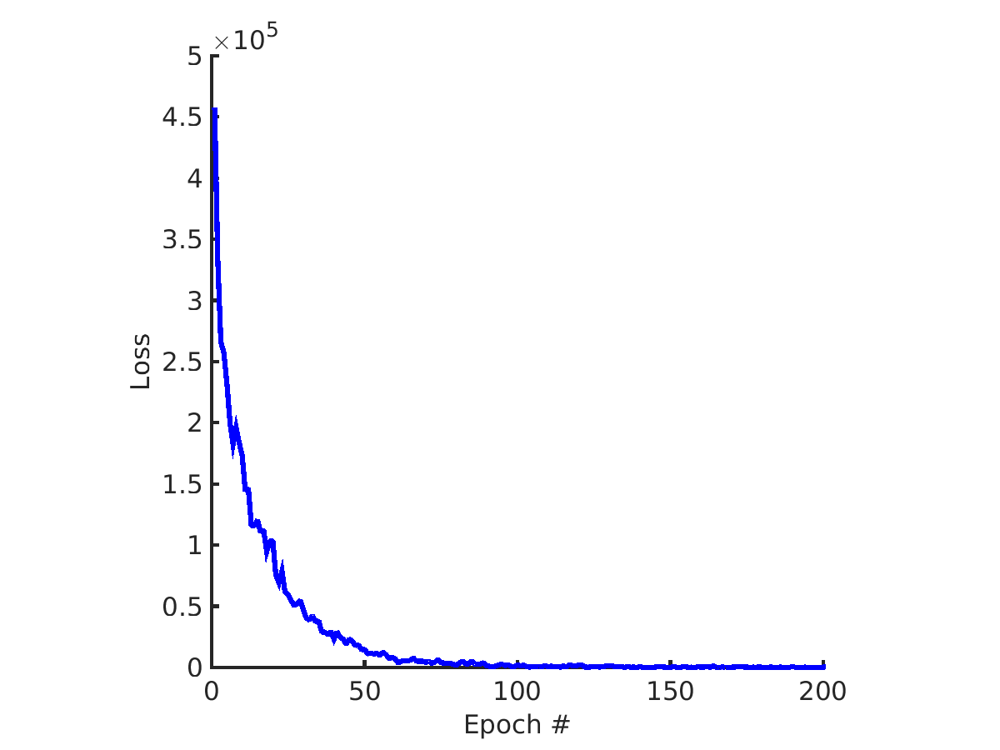

#      Convolutional Neural Network for Facial Recognition Using Tensorflow        #

This is a convolutional neural network implemented in Tensorflow for facial recognition. I used Yale's Face Database(http://cvc.cs.yale.edu/cvc/projects/yalefaces/yalefaces.html) for training and testing the model.   

In the figure below I compare the accuracy of the model on the testing set with and without dropout after 200 epochs.  Learn more about dropout here https://www.cs.toronto.edu/~hinton/absps/JMLRdropout.pdf
##	Accuracy of CNN With and Without Dropout	##

And the following figure shows how the loss function decays with training...
##	Decay of Loss Function Over Epochs	##

